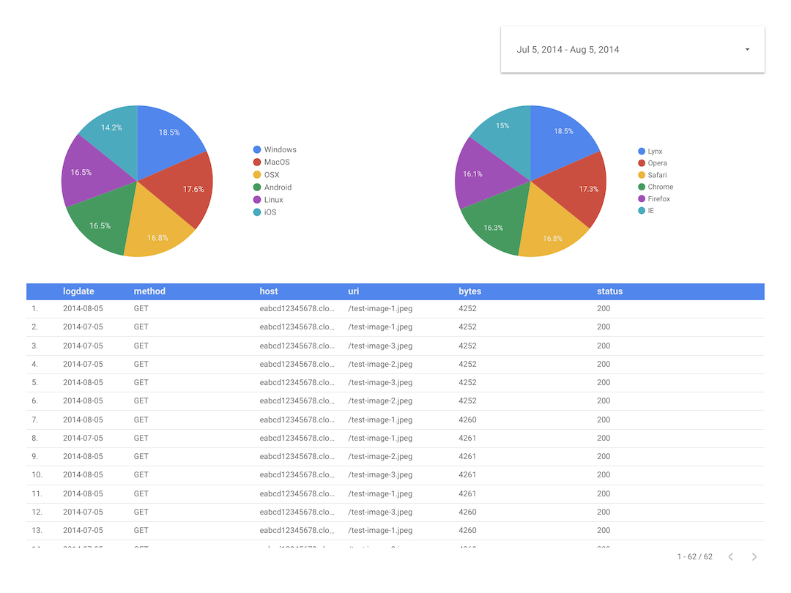

# AWS Athena Connector for Data Studio



*This is not an official Google product*

This [Data Studio](https://datastudio.google.com) [Community
Connector](https://developers.google.com/datastudio/connector) lets users query data from AWS S3 Buckets directly.

The connector is using [AWS Athena](https://aws.amazon.com/athena/) for underlying queries.

## Try the Community Connector in Data Studio

### Notes

This example is running in the `us-west-2` region.

### Create IAM User

Create an [IAM User](https://console.aws.amazon.com/iam/home) with **programmatic access**.

Attach managed policies `AmazonAthenaFullAccess` and `AmazonS3ReadOnlyAccess` to this user.

Remember the user's access key and secret.

### Create Athena Table

Visit the [Athena Console](https://us-west-2.console.aws.amazon.com/athena/home) and create a sample table:

```
CREATE EXTERNAL TABLE IF NOT EXISTS cloudfront_logs (
  LogDate STRING,
  Time STRING,
  Location STRING,
  Bytes INT,
  RequestIP STRING,
  Method STRING,
  Host STRING,
  Uri STRING,
  Status INT,
  Referrer STRING,
  os STRING,
  Browser STRING,
  BrowserVersion STRING
  ) ROW FORMAT SERDE 'org.apache.hadoop.hive.serde2.RegexSerDe'
  WITH SERDEPROPERTIES (
  "input.regex" = "^(?!#)([^ ]+)\\s+([^ ]+)\\s+([^ ]+)\\s+([^ ]+)\\s+([^ ]+)\\s+([^ ]+)\\s+([^ ]+)\\s+([^ ]+)\\s+([^ ]+)\\s+([^ ]+)\\s+[^\(]+[\(]([^\;]+).*\%20([^\/]+)[\/](.*)$"
  ) LOCATION 's3://athena-examples-us-west-2/cloudfront/plaintext/';
```

You could then try `SELECT * FROM "default"."cloudfront_logs" limit 10;` to preview the table.

### Setup Connector

In the connector, fill in the values like this:

Key                      | Value
-------------------------| -----
`AWS_ACCESS_KEY_ID`      | {KEY}
`AWS_SECRET_ACCESS_KEY`  | {SECRET}
`AWS Region`             | {AWS_REGION}
`Glue Database Name`     | `default`
`Glue Table Name`        | `cloudfront_logs`
`Query Output Location`  | `s3://aws-athena-query-results-{account_id}-us-west-2/data-studio`
`Date Range Column Name` | `LogDate`

For `Query Output Location`, AWS should have created a S3 bucket to store the query results, you could find the bucket name in S3 console.

If not, you could create a S3 bucket that starts with the name `aws-athena-query-results-` yourself.

### Create Report

Data Studio will automatically crawls the table schema.

Update the data type of `LogDate` from `TEXT` to `DATE(YYYYMMDD)`, then continue.

You could then try to explore the data. Note that the sample data is ranged from `2014-07-05` to `2014-08-05`.
