# Mite Connector for Google Data Studio

***Disclaimer:** This is not an official Google product*

***Copyright:** Matthias Heise, The unbelievable Machine Company GmbH, 2020*

The connector provides data from the [Mite Time Tracking](https://mite.yo.lk/) for [Google Data Studio](https://datastudio.google.com/) thus enabling the creation of customized reports. It is based on the [Mite REST API](https://mite.yo.lk/en/api/index.html) using an the customer `DOMAIN` and an `API KEY` as described in the [Mite authentication](https://mite.yo.lk/en/api/index.html#authentication). Data access to Mite is `read-only` (e.g. `HTTP GET`). No content in Mite is being updated or deleted.

## License

The connector is published under the [Apache License 2.0](https://www.apache.org/licenses/LICENSE-2.0) as stated in the [LICENSE](license.htm) file.

## Information

The connector has been created by [Matthias Heise (GitHub: Nagilo1)](https://github.com/nagilo1) while being employed at the [The unbelievable Machine Company GmbH](). All development has been done in private after regular working hours.


## Simple Setup

The simple setup is for those who just want to use the connector without developing it any further or without making any change to its code. Download or clone this repository onto your local disk. Go to [Google Apps Script](https://script.google.com/home) and create a new project. Upload all `*.js` source code files from the `/src` folder into your newly created project while ignoring the `/src` path. Files will be renamed from `*.js` to `*.gs` automatically. Deploy the connector [via the manifest](https://codelabs.developers.google.com/codelabs/community-connectors/#12).


## Advanced Setup

The advanced setup is for those who want to stay up-to-date with the continoued development of this connector or for those who want to make changes to the code on their own. It will link your local version with your personal Google Apps Script and the [Community Connectors for Google Data Studio GitHub](https://github.com/googledatastudio/community-connectors).

### Google App Script & CLASP

If not yet done, setup the Apps Script CLI [Command Line Apps Script Project (CLASP)](https://developers.google.com/apps-script/guides/clasp) locally. Then go to [Google Apps Script](https://script.google.com/home) and create a new project and link it to your local machine via `clasp clone <scriptId>`. You may also create the new project locally via `clasp create [scriptTitle]` and upload it via `clasp push` later on.

### Local code repository

Clone this repository onto your local disk into the folder that has been created by CLASP. This allows you to easily retrieve future updates via the `git pull` command. All relevant source code will be inside the `/src` folder.

If not yet present, create the following ignore files. First, the `/.gitignore` file ensures that only relevant source code and documentation is handled to the repository.

```
# file: 

**/**
!src/
!doc/
!doc/*.*
!*.js
!appsscript.json
!*.md
!.gitignore
!.claspignorefile
```

Second, the `/src/.claspignore` file will make sure that only relevant JavaScript files will be uploaded to Google AppScript later on.

```
**/**
!*.js
!appsscript.json
```

Finally, upload the relevant content via the `clasp push` command. Once done, you will find all source code files from the `/src` folder within your personal Google Apps Script project.

### Deployment for personal usage

You can immediately [use and test](https://developers.google.com/datastudio/connector/use) the script using the HEAD deployment [via the manifest](https://codelabs.developers.google.com/codelabs/community-connectors/#12). If you are going to change the code or improve the script, then it is recommended to create [separate deployments](https://developers.google.com/datastudio/connector/deploy). If you prefer local development over the browser based version, then go with CLASP or setup the `dscc-gen` aka [Data Studio Custom Connector Generator](https://developers.google.com/datastudio/connector/local-development).


## Configuration

Once the source code is avaible in the Google Apps Script project and the project has been deployed via its manifest, the connector shows up the gallery of available connectors when creating new [data sources](https://datastudio.google.com/navigation/datasources).

Go to your [Google Drive](https://drive.google.com/) or [Google Data Studio](https://datastudio.google.com/) and create a new data source via the create button. The drive lets you organize your reports and data sources in folders while the Data Studio will display them flat.

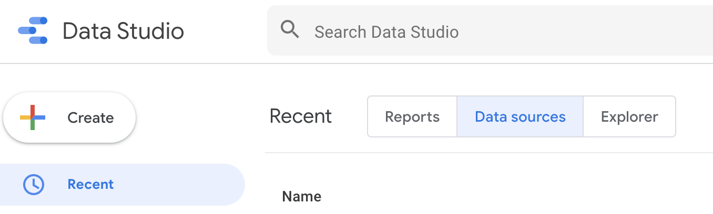


<br><br>
Then search for `mite` and click the desired connector.

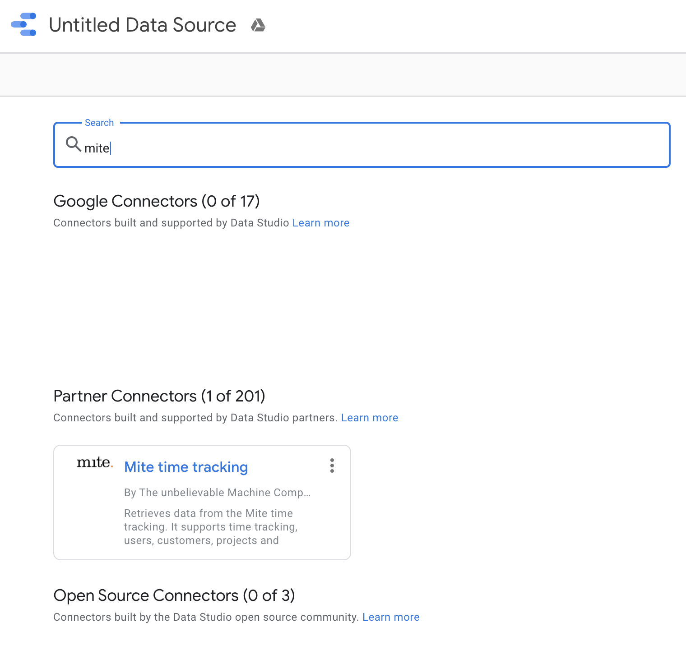


### Authentication

When using the connector for the first time, you will be asked to [authorize](https://codelabs.developers.google.com/codelabs/community-connectors/#12) the connector against your Google account. 

Next you need to provide your credentials consisting of your Mite customer `DOMAIN` and an `API KEY` as described in the [Mite authentication](https://mite.yo.lk/en/api/index.html#authentication). Both, the authorization and the Mite credentials will be stored by Google Data Studio until you are revoking the connectors access rights. Until then you will not be asked for those agian.

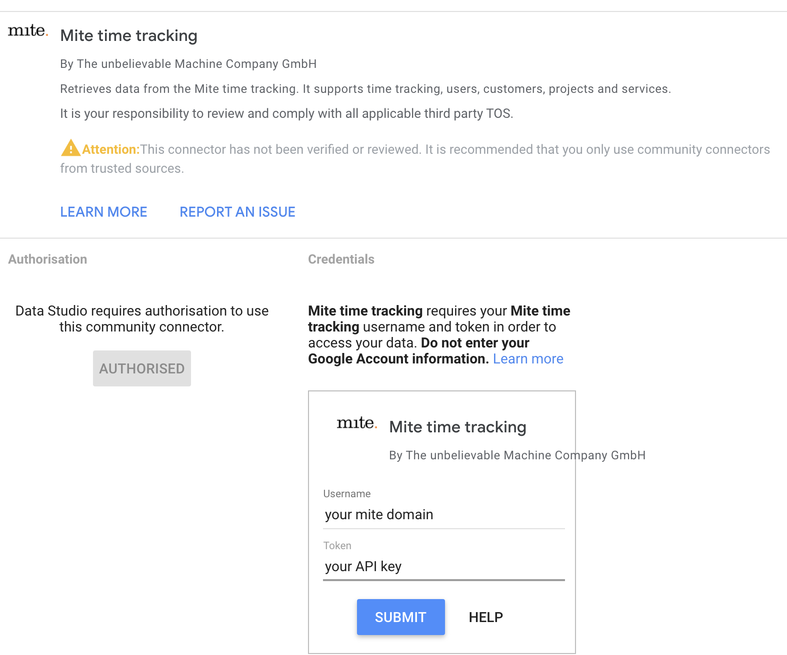


### Selecting the Mite API

Mite offers the following API's that are fully integrated in this connector: 

- Time Entries ([plain](https://mite.yo.lk/en/api/time-entries.html) or [grouped](https://mite.yo.lk/en/api/time-entries.html#list-grouped); requires a date range)
- [Customers](https://mite.yo.lk/en/api/customers.html)
- [Projects](https://mite.yo.lk/en/api/projects.html)
- [Services](https://mite.yo.lk/en/api/services.html)
- [Users](https://mite.yo.lk/en/api/users.html)

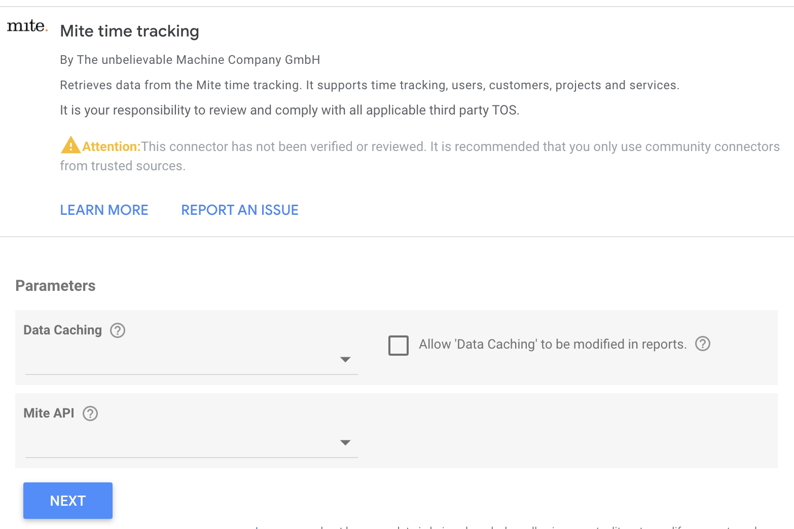

### Further configuration

#### Caching

Raw data being retrieved by the API is cached by the connector according to the configuration. For further details and privacy concern, please read below. The raw data is then converted into a format for Google Data Studio. The studio [will cache that data](https://support.google.com/datastudio/answer/7020039) according to a global connector configuration. It decides internally wether to use its own cached data or if the connector will be asked to provide new data.

#### Group by (pivotal data)

All Mite APIs will deliver their results in a flat manner. Only the Mite Time Entries API [allows grouping](https://mite.yo.lk/en/api/time-entries.html#list-grouped) by customer, project, service, user, day, week, month or year in a custom order. Grouping will effect the final data schema. Therefore, the grouping must be configured and can not be changed later on.

#### Billable vs. non-billable services

Google Data Studio provides filters only for those fields that are specified by the data source. For Mite time entries being grouped by customer, project, user or time (day, week, month, year), there is no boolean field indicating if the service (hours booked) are billable or non-billable. Contrary, the Mite API does support such filters. Therefore, that specific filter must be set on data source level. By default, this should be blank. If the data source contains a the billable field (e.g. flat time entries), then the filters being set in the report itself may override this configuration.

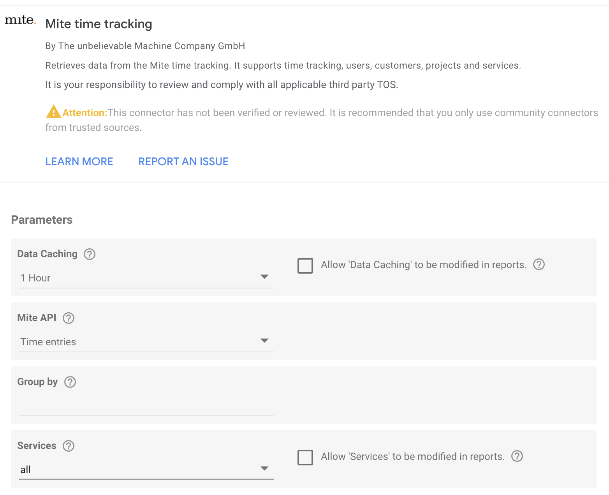

### Available fields

Once the configuration is complete, you can review the fields. Those depend on the Mite API that has been configured in the previous step.

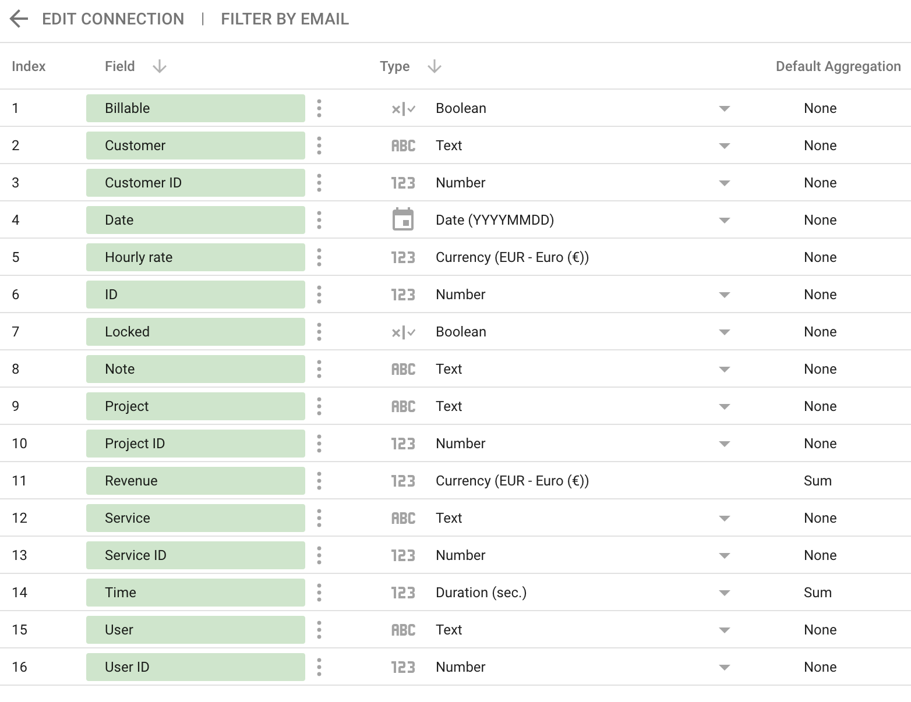


### Data caching, GDPR & legal notes

#### Credentials and personal information

The information on the Mite domain and API key configured on the data source is being stored as plain text using the [Google CacheService](https://developers.google.com/apps-script/reference/cache/cache-service) and the user realm. This ensures that data is related to the user who configured the data source only and not share between different Mite domains or Mite users. All data being cached is invisble and non-browsable to anyone.

[Google CacheService](https://developers.google.com/apps-script/reference/cache/cache-service) and the user realm are also used to store all data being retrieved from the Mite API in order to reduce the number of subsequent API calls and improve the report performance and user experience. Data is stored as plain text. Caching can be disabled when configuring the data source. This is true for Mite data. Credentials need to be stored anyway.

#### HTTPS connection (encryption at rest)

While the resulting data is retrieved and cached as plain text, the connection itself is secured and data transfer is encrypted. The URL `https://<YOUR_DOMAIN>.mite.yo.lk` is being used.


## Sharing

You can use the connector for yourself or share its functionality with other team mates or project managers. There are several ways to achieve that.

### Sharing the connector as a template

If you successfully deployed and configured your connector for yourself, it is authorized against your Google account and it will use your Mite credentials as described above. If you want to avoid that, you need to [share the connector](https://developers.google.com/datastudio/connector/share) template (Google Apps Script project) with others. In this case others need to configure own data source (instances of the connector) using their own credentials. For details, please refer to `Configuration`, see above.

### Sharing preconfigured connnector instances

If you are fine with your preconfigured instances that are using your own Mite credentials (or credentials that are used company wide), then you may share each instance with your team mates. 

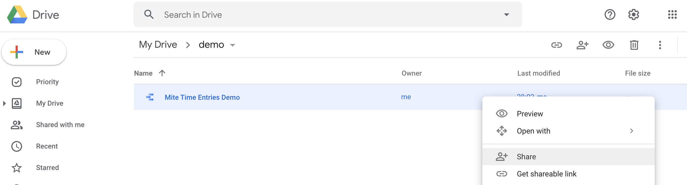

In this case others still need to create their own reports while adding the shared data sources to the report.

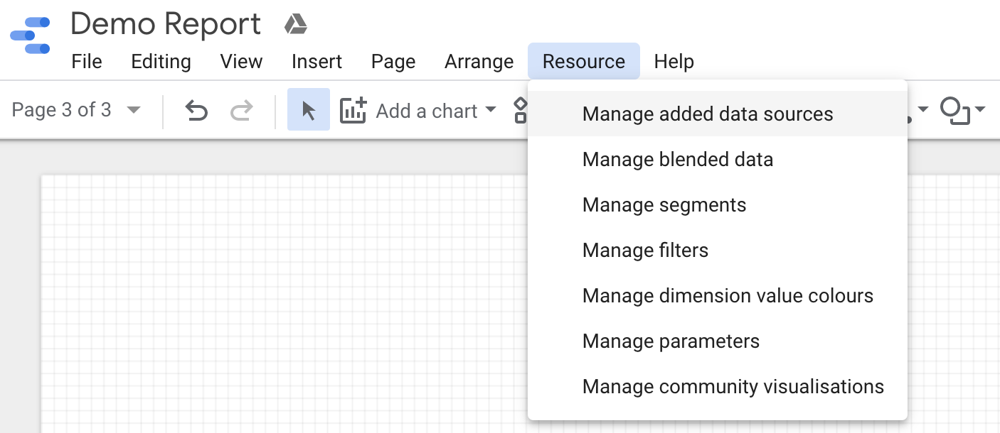

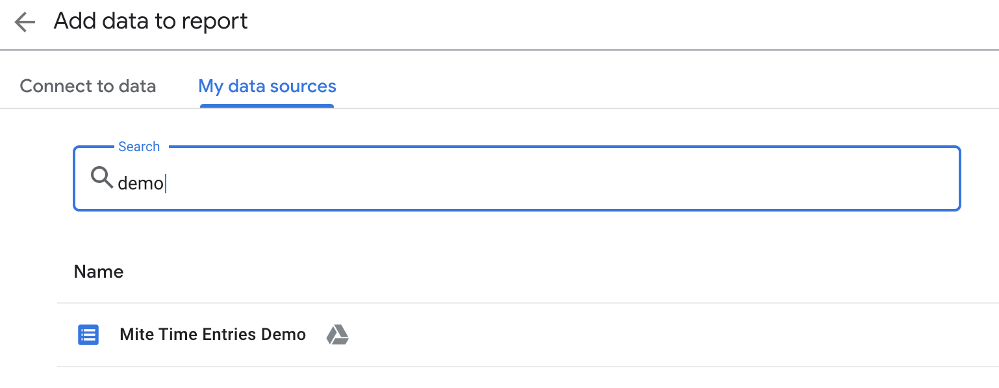


### Sharing preconfigured reports

In case you just want to share your data insights (the report itself) with others, then it is recommended to just share the report and not the data sources nor the connector template. In this case others can view your report with actual data that is retrieved from your data sources using your Mite credentials. No furher sharing is needed. It is recommended to share the report in view-only mode.

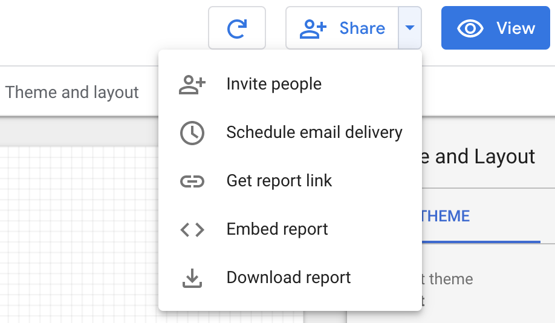


## Usage

This is a reference for everyone who is going to use the Mite connector inside a Google Data Studio report. 

### Date range & report filters

The data being retrieved from Mite might get huge depending on the date range or number of customers, projects or users being requeted. This is especially true if no date range or filters are provided at all. The report will be slow and Mite may lock your account if API requests and data transfer are going crazy. 

Therefore, it is highly recommended setting a custom date range on report level and pre-select a rather short date range (e.g. current month or last week). 

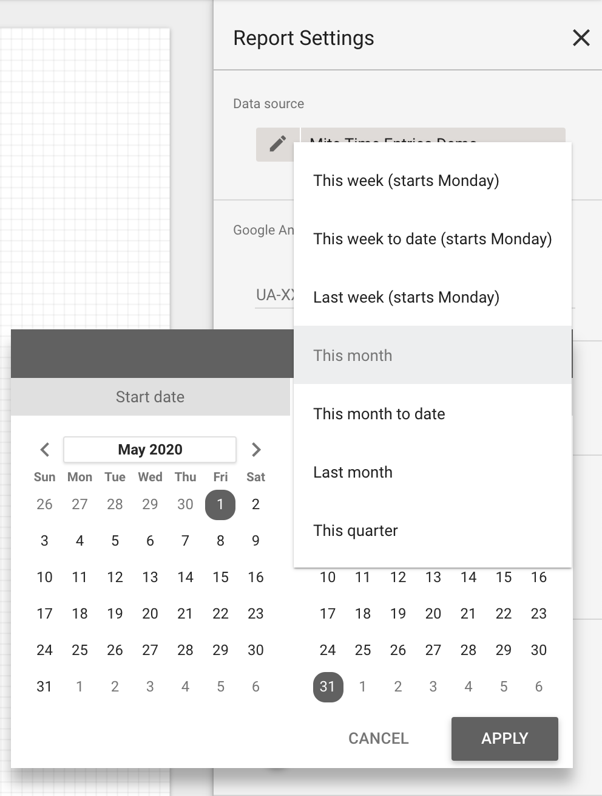

If the date range should be selected by the user, add a date range control to the report and pre-select a rather short date range as well or make it inherit the custom date range from the report settings.

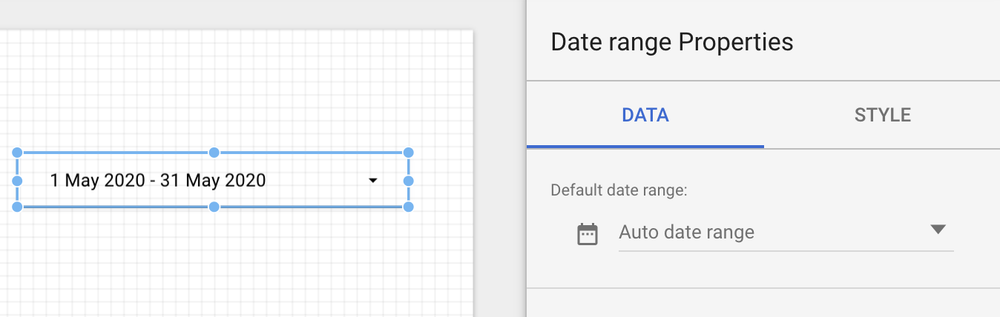

Once the date range is configured, the report should be filtered even further. In most of the cases the report will be showing data for a specific customer, project or set of users only. Therefore those should be set as filters on report level. Unfortunately you need to provide ids. Those can be retrieved from the Mite time tracking web UI. 

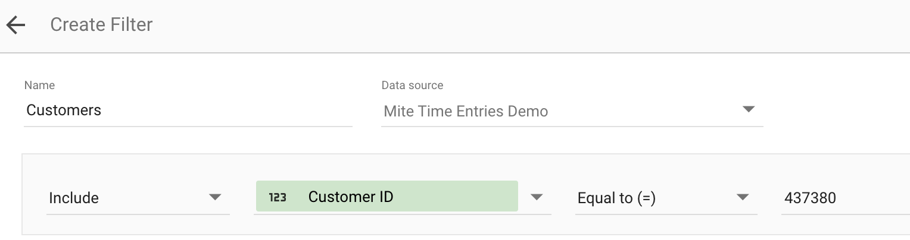

Both, date range and filters will automatically be used by any widget (element, control or diagram) in the report unless you deactivte it. 

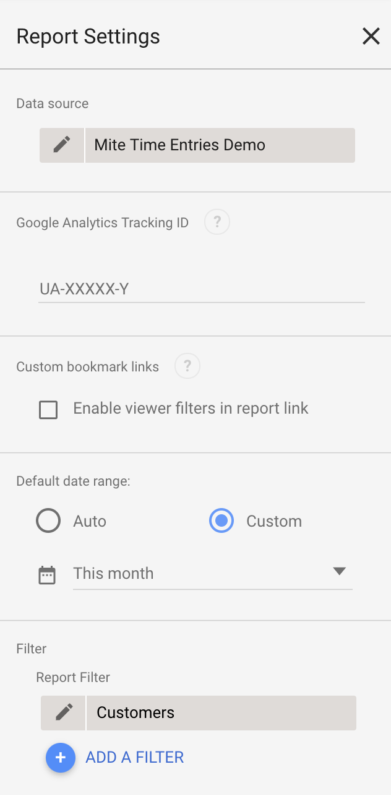

Filters should also be set on the original data source when creating blended (e.g. joined or combined) data sources.

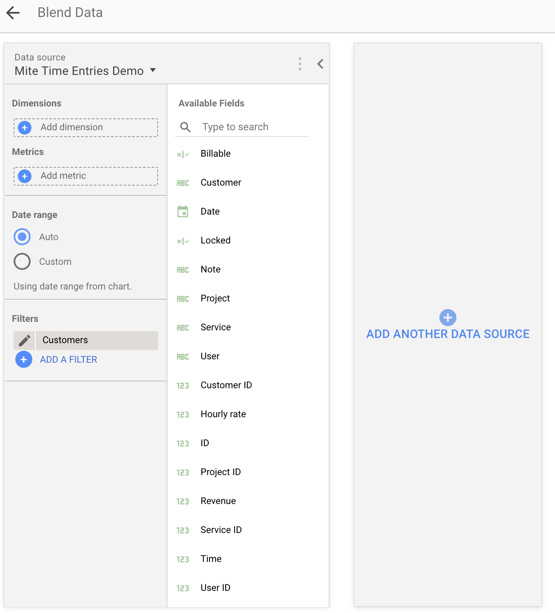

### Advanced examples (calculated fields)

#### Time conversions

Data of type duration (e.g. time booked) is specified as seconds. If you are interested in displaying hours, add create a new (calculated) field and change as a dimension or metric and convert the seconds to hours. 

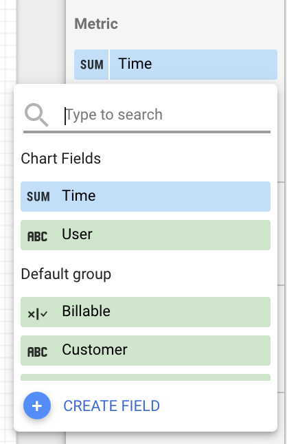

Also change the type to numeric duration. This will automatically show the duration in the `hh:mm:ss` format.

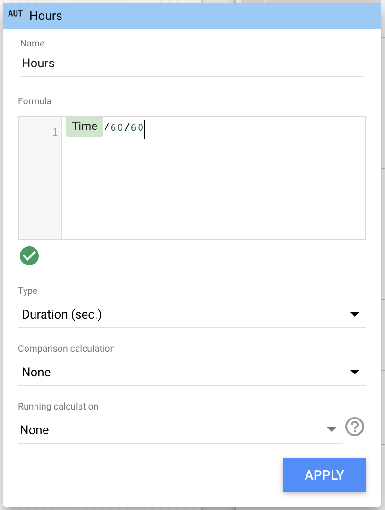

#### Days, Months or weeks (date formats)

Some fields are given as a date YYYY-MM-DD. Those can be easily shown as weekday, week number or other. To do so, select the diagram and click the field name in the data page. The select the desired detail level.

#### First names

User names are given as first name and last name in one field. Quite often, just the first name is needed. In this case you can create a calculated field at diagram or data source level. For all calculated fields that are commonly used, it is recommended to add them on data source level. The following function will extract the first name from the user. German Umlauts are not recognized.

```
REGEXP_EXTRACT(User,'^([\\w\\-]+)')
```

#### Actual versus projected times

At any day during the current month, you can calculate the daily average of hours a user has booked or hours being booked onto a project. Therefore, the Mite time entries API must be grouped by customer, project or user without providing a time grouping. In that case the data source will contain a `From` and a `To` field indicating the first and the last day for that data entry according to the date range. Based on the `To` and the `Time` fields the daily average can be calculated and used as a projection for the rest of the month.

```
(Time/DAY(To)*(30-DAY(To))+Time)/60/60
```

## Development notes

### References and inspirations

1. [Build a Community Connector](https://developers.google.com/datastudio/connector/build) published by Google
2. [Build a Community Connector Code Lab](https://codelabs.developers.google.com/codelabs/community-connectors) published by Google.
3. [Community Connector API Reference](https://developers.google.com/datastudio/connector/reference) published by Google.
4. [Google Apps Script Reference](https://developers.google.com/apps-script/reference) published by Google.
5. [Building a custom Google Data Studio connector from A-Z](https://medium.com/@bajena3/building-a-custom-google-data-studio-connector-from-a-z-part-2-oauth-calling-apis-caching-edb3e25b18e7) published by [Jan Bajena](https://medium.com/@bajena3) in 2018; especially on data caching.
6. [Community connector for Kaggle](https://github.com/googledatastudio/community-connectors/tree/master/kaggle); especially on authorization via user tokens.
7. [Script and User Properties Google Apps Script](https://kurtkaiser.us/script-and-user-properties-google-apps-script/) published by [Kurt Kaiser](https://kurtkaiser.us/); especially on how to store and retrieve user credentials and avoiding plain text credentials in source code.
8. Other implementations of custom connectors available in the [Community Connectors for Google Data Studio GitHub](https://github.com/googledatastudio/community-connectors).

### Implemented features

- User token authorization using the Mite customer domain and an API key. 
- Secure storage and retrieval of Mite credentials.
- Data caching based on [Google CacheService](https://developers.google.com/apps-script/reference/cache/cache-service) using the user realm.
- Low-level filtering using the Mite API as for instance filtering [Mite Time Entries](https://mite.yo.lk/api/zeiten.html) using parameters.
- Key-Value caching for translating names given by a [filter control](https://support.google.com/datastudio/answer/6312144) into their low-level Mite API id. For instance translating a project name, which can not be used for filtering against the Mite API, into the project id.

### Not yet implemented features

- [Mite HTTP Caching and conditional requests](https://mite.yo.lk/en/api/index.html#conditional-requests) using the ETag
- unit tests

### Unit tests

- not yet implemented
