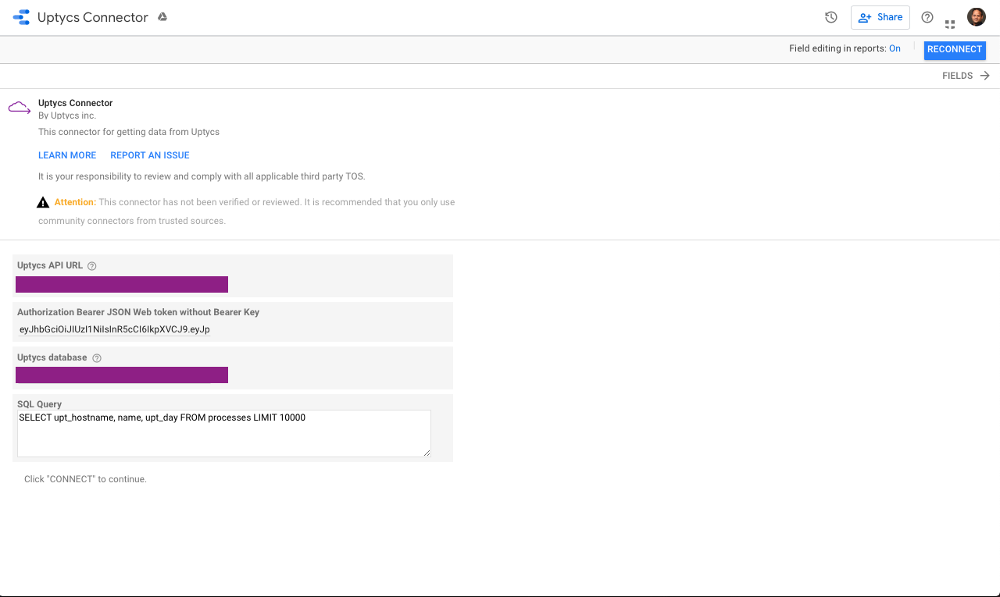
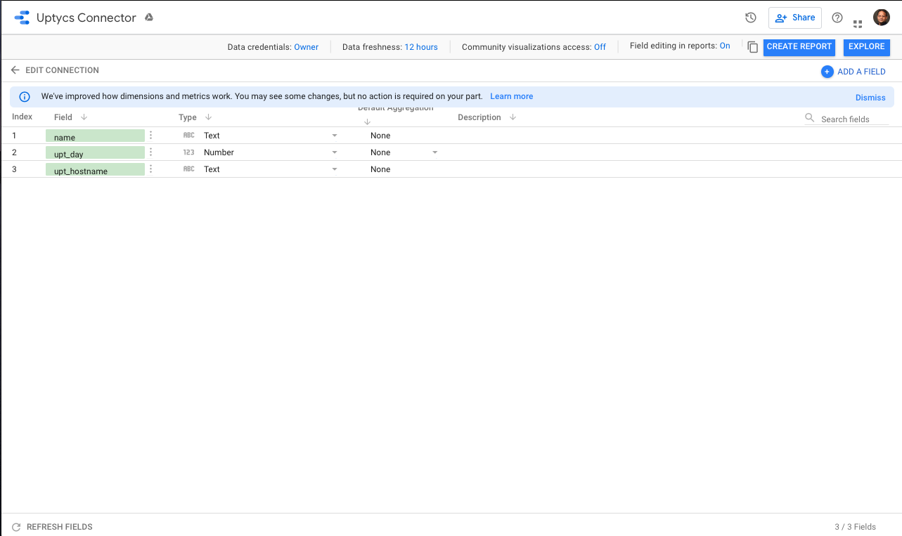
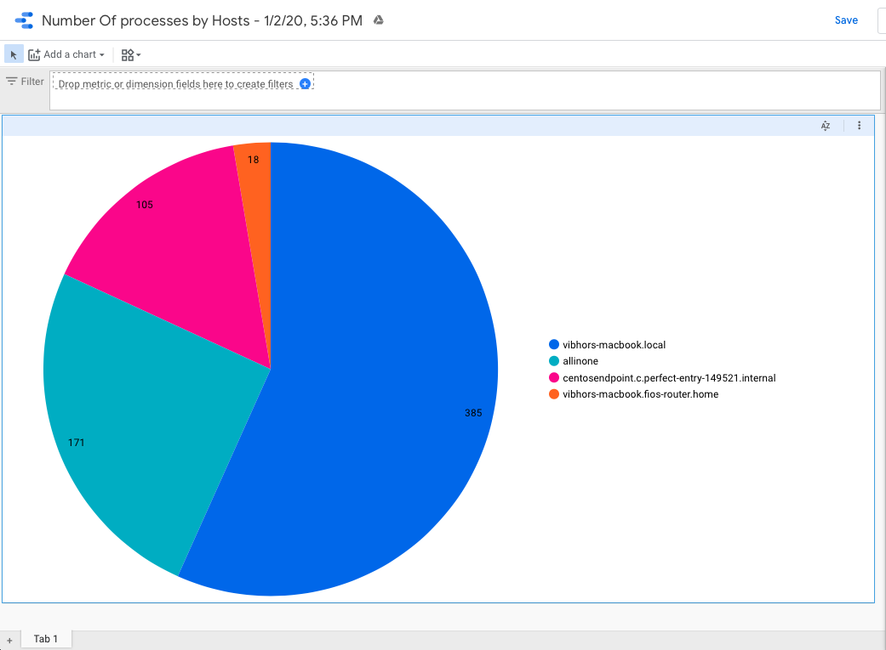

# Uptycs Connector for Data Studio

*This is not an official Google product*

Uptycs Connector for Data Studio

This [Data Studio] [Community Connector] lets you query data directly from Uptycs data store using SQL.

## Set up the Community Connector for personal use

To use this Community Connector in Data Studio there is a one-time setup to
deploy your own personal instance of the connector using Apps Script.

### Deploy the connector
Follow the [deployment guide] to deploy the Community Connector.

## Using the connector in Data Studio

Once you've set up and deployed the connector, follow the
[Use a Community Connector] guide to use the connector in Data Studio.

**Note**: After using the connector in Data Studio, as long as you do not
[revoke access], it will remain listed in the [connector list] for easy access
when [creating a new data source].

### Usage example with sample data

The following steps walk through an example of using the connector to query
sample data. 

1. Download Uptycs API key from Uptycs. 
2. Generate a JWT using KEY and Secret.
3. Configure the connector and enter your SQL as given in the below image:

4. Click Connect

### Sample Explorer

## Troubleshooting

### This app isn't verified

When authorizing the community connector, if you are presented with an
"unverified" warning screen see [This app isn't verified] for details on how to
proceed.

[Data Studio]: https://datastudio.google.com
[Community Connector]: https://developers.google.com/datastudio/connector
[Uptycs]: https://www.uptycs.com
[deployment guide]: ../deploy.md
[Use a Community Connector]: https://developers.google.com/datastudio/connector/use
[revoke access]: https://support.google.com/datastudio/answer/9053467
[connector list]: https://datastudio.google.com/c/datasources/create
[creating a new data source]: https://support.google.com/datastudio/answer/6300774
[This app isn't verified]: ../verification.md
